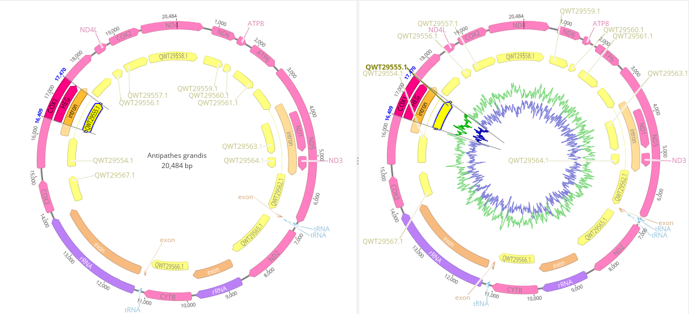

# Annotating *Antipathes grandis* 

**Objective:** Annotate *Antipathes grandis* (red polyps)(187-W-Maui) collected in the Au'Au Channel.

**Methods:**

1. Inspect large_contigs_187.fasta produced by SPAdes.
2. Select best candidate for downstream analysis (NODE_1_length_20611_cov_7.376538) and BLAST this node.
3. BLAST results revealed 99% Query Cover and 99.76%, 98.99% Per. Identity for Stichopathes sp. SCBUCN-8850 and Stichopathes sp. SCBUCN-8849, respectively.
4. Download relevant *A. grandis* material from GenBank; place these files into the "Reference Features" subfolder labeled "antipatharians".
5. Transfer annotations from database. (See Figure 1)
    

Figure 1. Initial mitochondrial genome annotations for *Antipathes grandis* (red polyps) collected in the Au'Au Channel.
