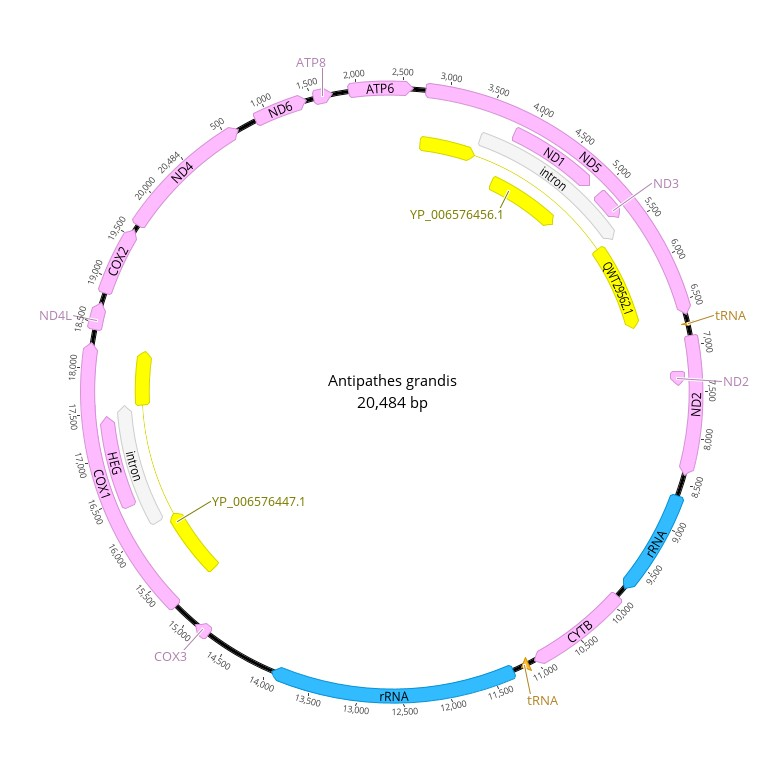
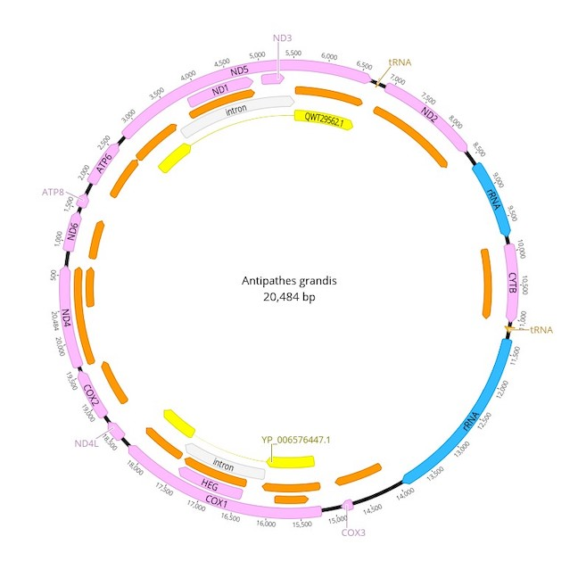
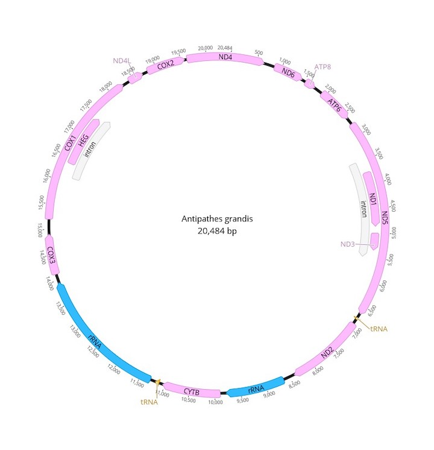

# Annotating *Antipathes grandis* 

**Objective:** Annotate *Antipathes grandis* (red polyps)(187-W-Maui) collected in the Au'Au Channel.

**Methods:**

1. Inspect large_contigs_187.fasta produced by SPAdes.
2. Select best candidate for downstream analysis (NODE_1_length_20611_cov_7.376538) and BLAST this node.
3. BLAST results revealed 99% Query Cover and 99.76%, 98.99% Per. Identity for Stichopathes sp. SCBUCN-8850 and Stichopathes sp. SCBUCN-8849, respectively.
4. Download all relevant *A. grandis* material from GenBank; place these files into the Reference Features subfolder labeled "antipatharians".
5. In Geneious Prime "Find Repeats", remove the duplicated repeat at the and end of the sequence then "Circularize Sequence."
6. Transfer annotations from database. (See Figure 1)
7. Create two working iterations, one specifically to compare annotations for COX3, COX1, tRNA & ND2 among color morphs. This second iteration was a 100% match to (GU296499 and GU296487) the red morphotype. 
8. Submit .fasta file to Mitos2 (job settings: RefSeq 89 Metazoa, Genetic code: 4 Mold). Compare output to transferred annotations.
9. "Find ORFs" and locate start codons.
10. Input "500" for "Minimum size"; select "Mold Protozoan Mitochondrial transl_table 4" for "Genetic code". This will auto-populate the relevant start codons.
11. Are ORFs consistent with annotations? (See Figure 2.)
12. Based on inconsistencies between Mitos2 and transferred annotations from reference genomes ND1, ND2, ND4, COX2, COX3, and HEG were altered. These adjusted annotations were modified by looking at the ORF provided by Geneious Prime. (See Figure 3 for final annotations)
    

Figure 1. Initial mitochondrial genome annotations for *Antipathes grandis* (red polyps) collected in the Au'Au Channel.

Figure 2. Mitochondrial genome annotation for *Antipathes grandis* (red polyps) collected in the Au'Au Channel showing open reading frames (orange) and coding regions (yellow) generated via "Find ORFs" in Geneious Prime.

Figure 3. Final mitochondrial genome annotations for *Antipathes grandis*.
