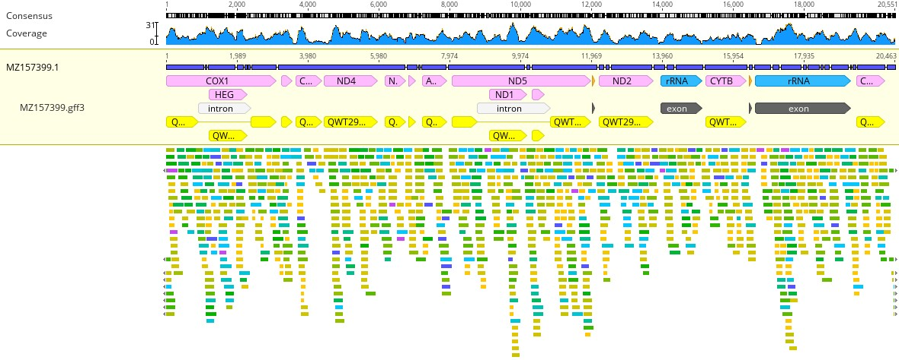

# Annotating *Aphanipathes* sp. 

**Objective:** Annotate *Apahnipathes* sp.(130-W-Maui) collected in the Au'Au Channel.

**Methods:**

1. Inspect large_contigs_130.fasta produced by SPAdes.
2. Export as a .fasta file and then BLAST NODE_1_length_16557_cov_5.095557 and NODE_3_length_14543_cov_8.299022.
3. BLAST results revealed NODE_1_length_16557_cov_5.095557 to be the most appropriate candidate for downstream analysis because it aligned with antipatharians. Results yielded 100% Per. Ident to all *Aphanipathes* partial mitogenome sequences.
4. BLAST results yielded the following: Query Cover 94%, Per. Ident 92.70% to *Stichopathes* sp. SCBUCN-8850 (MZ157399), Query Cover 94%, Per. Ident 92.21% to (JX023266), and 92% to *Stichopathes* sp. SCBUCN-8849 (MZ157400). Other matches were 80% or less for both Quer Cover and Per. Ident.
5. Download relevant *Apahnipathes* material from GenBank; place these files into the "Reference Features" subfolder labeled "antipatharians".
6. In Geneious Prime: "Find Repeats". No repeats were found, further suggesting this is a partial mitochondrial genome.
7. Create two iterations: one will contain Mitos2 dictated annotations and the other will be results of annotations that were transferred from library.
8. Submit .fasta file to Mitos2 (job settings: RefSeq 89 Metazoa, Genetic code: 4 Mold). (iteration 1)
9. Transfer annotations from database.(iteration 2). Annotations revealed an alignment in the reverse direction. Created a reverse compliment.
10. Annotations didn't appear to transfer well (low similarity 90%). Opted to explore mapping trimmed reads to reference genome.
11. scp "trimmed_reads" for 130, input 130.F.fq.gz and 130.R.fq.gz into Geneious separately, paired them and then mapped these reads to MZ157399. (See Figure 1)
12. A consensus sequence of 20, 395 bp was generated.
13. This consensus sequence was BLASTed. Top 3 results were as follows: 98% Query Cover, 92.61 Per. Ident to (MZ157399.1), 97% Query Cover, 91.48 Per. Ident to (JX023266.1), 96% Query Cover, 92.42 Per. Ident to (MZ157400.1). All partial *Aphanipathes* scored either 100 Per. Ident or >99.%.

14. Annotations were transferred (via Geneious Prime) to this consensus sequence following same protocol above.

Figure 1. Trimmed MiSeq PE reads mapped to Stichopathes sp. SCBUCN-8850 (MZ157399).   