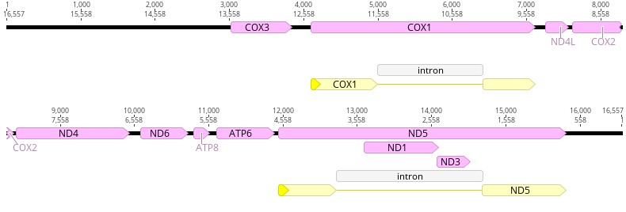

# Annotating *Aphanipathes* sp

**Objective:** Annotate *Apahnipathes* sp.(130-W-Maui) collected in the Au'Au Channel.

**Methods:**

1. Inspect large_contigs_130.fasta produced by SPAdes.
2. Export as a .fasta file and then BLAST NODE_1_length_16557_cov_5.095557 and NODE_3_length_14543_cov_8.299022.
3. BLAST results revealed NODE_1_length_16557_cov_5.095557 to be the most appropriate candidate for downstream analysis because it aligned with antipatharians. Results yielded 100% Per. Ident to all *Aphanipathes* partial mitogenome sequences.
4. BLAST results yielded the following: Query Cover 94%, Per. Ident 92.70% to *Stichopathes* sp. SCBUCN-8850 (MZ157399), Query Cover 94%, Per. Ident 92.21% to (JX023266), and 92% to *Stichopathes* sp. SCBUCN-8849 (MZ157400). Other matches were 80% or less for both Quer Cover and Per. Ident.
5. Download relevant *Apahnipathes* material from GenBank; place these files into the "Reference Features" subfolder labeled "antipatharians".
6. In Geneious Prime: "Find Repeats". No repeats were found, further suggesting the SPAdes contig is merely a partial mitochondrial genome. If this was a complete mitochondrial genome we would observe a repeated sequence at the start and end of the linear contig. Therefore, we will not circularize the sequence in Geneious Prime.
7.  Transfered annotations from database and utilized the "Find ORFs" function in the Live Annotate & Predict tab to verify start and stop positions for these transferred annotations. 

Final annotation is as follows:

  

