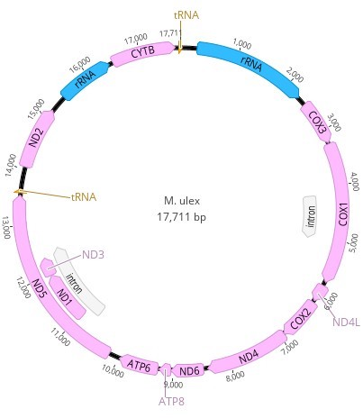
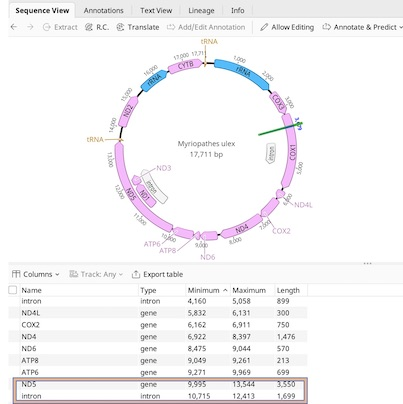

# Annotating *Myriopathes ulex*

**Objective:** Re-visit *Myriopathes ulex* annotations. We received feedback from GenBank saying that *ND5* was missing a legal start codon.

**Background:** The mitogenome we submitted to GenBank (NODE_5_length17838_cov_59.388403 from SPAdes assembly) was edited (repeat sequences at the start and end of the linear sequence removed) and then circularized. Annotations were then transferred from *Myriopathes japonica* onto the circularized sequence. This mitogenome submission (2022-07-21) (ID: 2605514) was 17,711 bp. See below.

**Methods:** 
1. Utilize "Find ORFs" in Geneious Prime to locate appropriate start codon for *ND5*. 
2. Input "200" for "Minimum size"; select "Mold Protozoan Mitochondrial transl_table 4" for "Genetic code". This will auto-populate the relevant start codons.
3. Inspect sequence (with the highlighted ORFs).
4. Locate the applicable start codon and edit the current annotation.
5. Resubmit this revised annotation to BankIt. See below.

**Results:** Resubmission accepted and accession number given OP104910.
