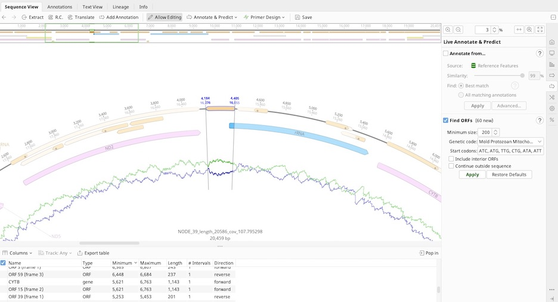

# Annotating *Stichopathes* sp.

**Objective:** Annotate *Stichopathes* sp. (180-W-Kaua) collected at Amber's Arches off of Kauai.

**Methods:** 
1. BLAST contigs.fasta from SPAdes output.
2. Select best candidate for downstream analysis (NODE_39_length_20586_cov_107.795298).
3. Find repeats at start and end then remove and circularize the linear sequence.
4. Transfer annotations from database.
5. Annotations revealed a reverse compliment was needed so "Reverse Compliment" in the "Sequence" tab was selected.
6. Utilize "Find ORFs" in Geneious Prime to locate appropriate start codon for *ND5*. 
7. Input "200" for "Minimum size"; select "Mold Protozoan Mitochondrial transl_table 4" for "Genetic code". This will auto-populate the relevant start codons.
8. Inspect sequence (with the highlighted ORFs). Geneious will transfer annotations, however it is imperative that manual inspection of sequence and start codons is performed. See below.
   

